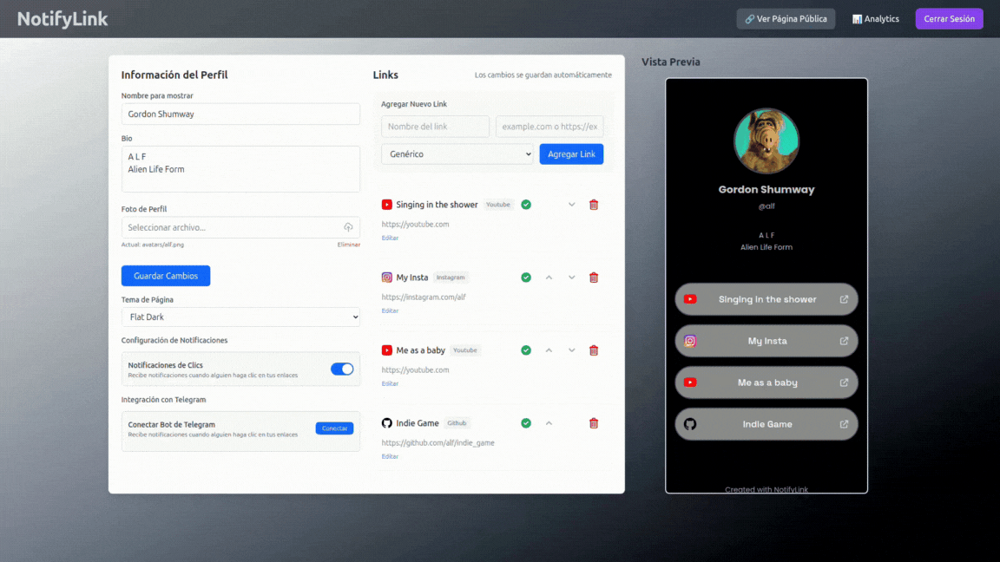

# NotifyLink

*A (not so healthy) clone of Linktree*  
**Get notified every time someone clicks one of your links.**  
For those who still get a dopamine hit every time they get attention.




## Features

- **(Almost) SaaS ready** - Custom user model with some subscription logic and landing page with plan descriptions
- **Database driven page themes** - Themes are stored as database models, making them easily manageable by admins. Users select from available theme presets
- **User page editor** - Write a bio, change page theme, add/remove/reorder links and define link types. Implemented with htmx
- **Analytics** - Track clicks
- **Telegram notifications** - Get instant notifications when someone clicks your links
- **AWS S3 Integration** - Production ready file storage for user uploads

## Django app structure and responsibilities

- **`core/`** - Users, authentication, subscription logic, and main page (landing)
- **`links/`** - Link management, page themes, user configuration page
- **`analytics/`** - Click tracking, analytics dashboard and notification services

## Installation

#### Quick Start
```bash
git clone https://github.com/mariocesarc/NotifyLink.git
cd notifylink
pip install -r requirements.txt
python manage.py makemigrations
python manage.py migrate
python manage.py loaddata core/fixtures/subscriptionplans.json
python manage.py loaddata links/fixtures/pagethemes.json
python manage.py runserver
```

#### Environment Setup
Create a `.env` file in the root directory for your secrets:
```bash
# .env
DEBUG=
SECRET_KEY=
DOMAIN_NAME=
CSRF_TRUSTED_ORIGINS=
CSRF_COOKIE_DOMAIN=

AWS_STORAGE_BUCKET_NAME=
AWS_S3_REGION_NAME=

TELEGRAM_BOT_TOKEN=

DB_NAME=
DB_USER=
DB_PASSWORD=
DB_HOST=
DB_PORT=
```

## Future Work
- **Google OAuth Sign in** - No one wants to create and remember one more password
- **Redis based click counting** - Use Redis to buffer click counts in real time and batch write to database periodically, instead of hitting the database with every link click
- **WhatsApp notifications** - For those who don't like to use Telegram
- **Custom theme editor** - Let users create personalized themes instead of choosing from predefined options
- **Rate limiting** - Protect against bot traffic and API abuse with configurable limits per endpoint
